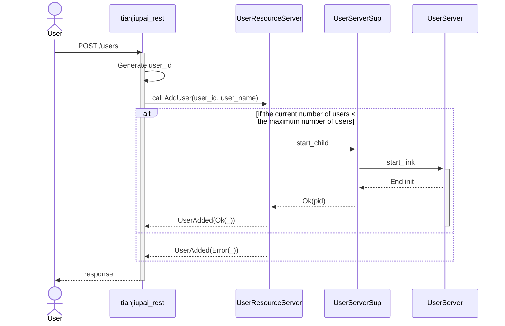
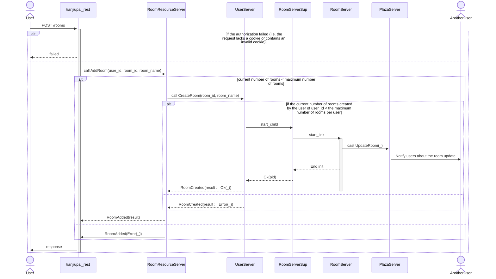
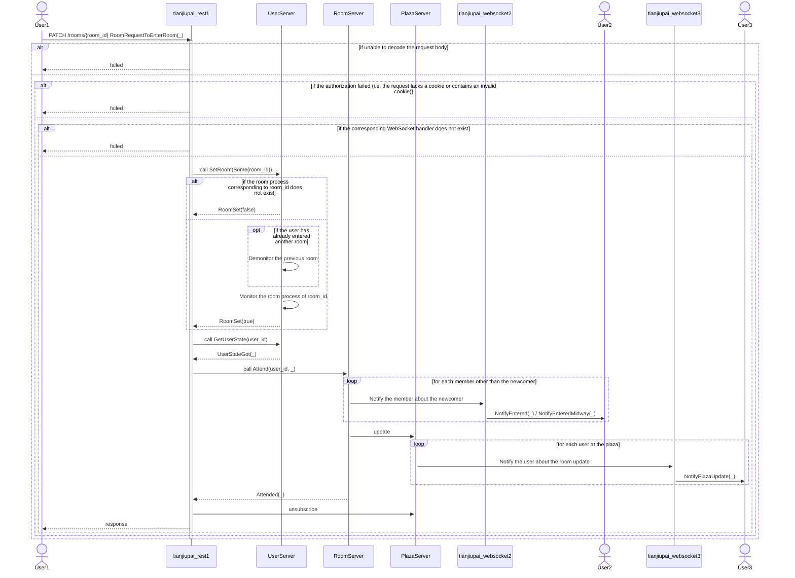
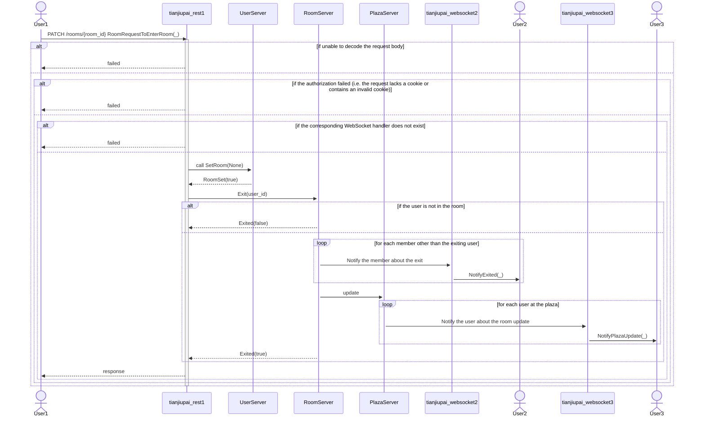
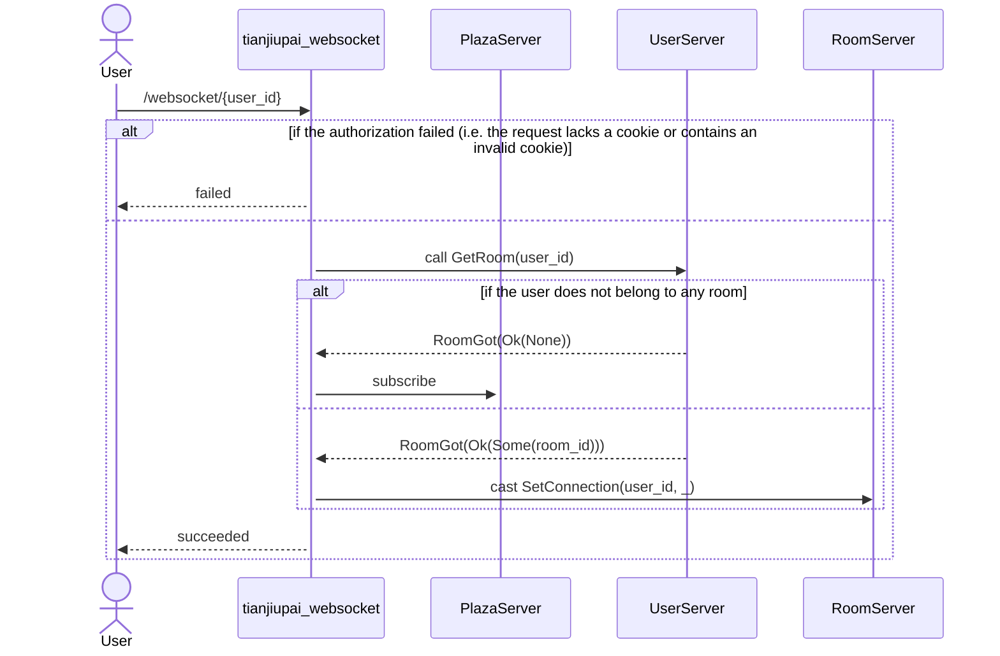
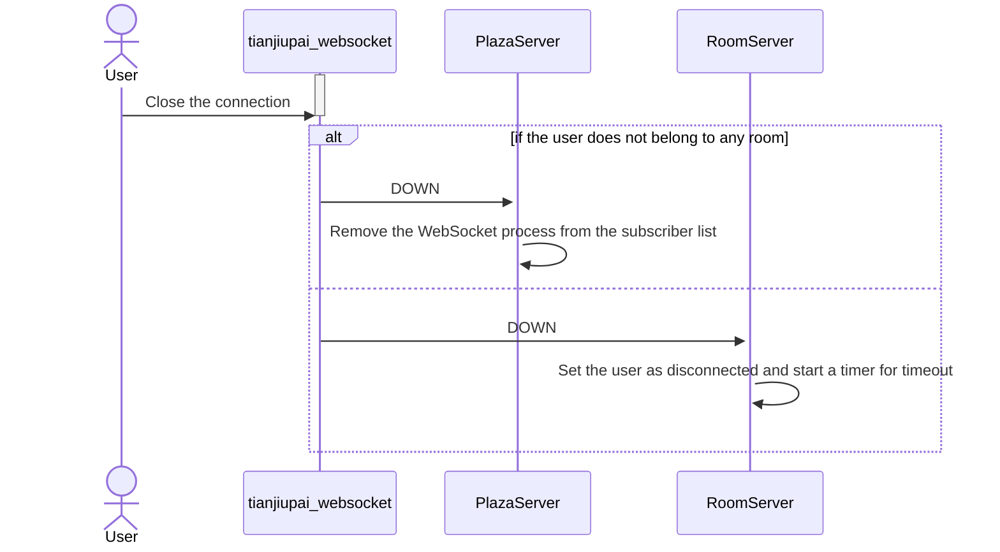
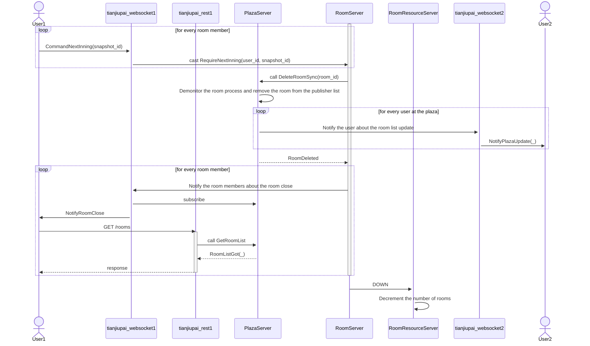

## 通信フローチャート

### ユーザ作成




### 部屋作成




### 入室

※これは典型的には正常に動作するが，複数リクエストのタイミングがきわどいと競合状態に陥りうる実装になっていそうなので，いずれ修正する．




### 退室

※これは典型的には正常に動作するが，複数リクエストのタイミングがきわどいと競合状態に陥りうる実装になっていそうなので，いずれ修正する．




### 牌を出す処理

```mermaid
sequenceDiagram
  actor User1
  participant tianjiupai_rest1
  participant RoomServer
  participant tianjiupai_websocket2
  actor User2
  activate RoomServer
  activate tianjiupai_websocket2

  User1 ->> PATCH /rooms/{room_id} RoomRequestToSubmitCards(_)
  alt if unable to decode the request body
    tianjiupai_rest1 -->> User1 : failed
  else
    alt if the authorization failed (i.e. the request lacks a cookie or contains an invalid cookie)
      tianjiupai_rest1 -->> User1 : failed
    else
      tianjiupai_rest1 ->> RoomServer : Submit(user_id, cards)
      alt if the room is waiting for a start or there exists a disconnected member
        RoomServer -->> tianjiupai_rest1 : SubmissionDone(None)
      else
        alt if the submitted cards are invalid
          RoomServer -->> tianjiupai_rest1 : SubmissionDone(None)
        else
          RoomServer ->> RoomServer : Update the table state
          loop for each member other than the submitter
            RoomServer ->> tianjiupai_websocket2 : Notify the member about the updated table state
            tianjiupai_websocket2 ->> User2 : NotifySubmission(_)
          end
          RoomServer -->> tianjiupai_rest1 : SubmissionDone(Some(_))
        end
      end
    end
  end
  tianjiupai_rest1 -->> User1 : response
  deactivate tianjiupai_rest1
  opt if the submission has successfully been done
    User1 ->> tianjiupai_websocket1 : CommandAck
    tianjiupai_websocket1 ->> RoomServer : cast Ack
    loop for each member other than the submitter
      User2 ->> tianjiupai_websocket2 : CommandAck
      tianjiupai_websocket2 ->> RoomServer : cast Ack
    end
    loop for each member (including the submitter)
      RoomServer ->> tianjiupai_websocket2 : Notify the user about the next step
      tianjiupai_websocket2 ->> User2 : NotifyNextStep
    end
  end
```


### WebSocket接続の確立




### WebSocket接続の解除




### 対局終了で部屋が消えるとき




## プロセス構成

* `UserServerSup` プロセス
  - 概要： `UserServer` プロセスたちを管理する．
  - 個数： 全体で1個
  - 存在期間： 恒に存在
  - 登録名： `Global({})`（Erlang： global, `{'Tianjiupai.UserServerSup', ok}`）
* `RoomServerSup` プロセス
  - 概要： `RoomServer` プロセスたちを管理する．
  - 個数： 全体で1個
  - 存在期間： 恒に存在
  - 登録名： `Global({})`（Erlang： global, `{'Tianjiupai.RoomServerSup', ok}`）
* `UserResourceServer`
  - 概要： ユーザ数を管理する．
  - 個数： 全体で1個
  - 存在期間： 恒に存在
  - 登録名： `Global({})`（Erlang： global, `{'Tianjiupai.UserResourceServer', ok}`）
  - モニタするプロセス：
    * 全ての存在する `UserServer` プロセス．
  - 受け取るメッセージ：
    * `tianjiupai_rest` プロセスから：
      - ユーザ作成依頼
    * `UserServer` プロセスから：
      - `DOWN`： ユーザが削除されたときに届く
* `RoomResourceServer`
  - 概要： 部屋数を管理する．
  - 個数： 全体で1個
  - 存在期間： 恒に存在
  - 登録名： `Global({})`（Erlang： global, `{'Tianjiupai.RoomResourceServer', ok}`）
  - モニタするプロセス：
    * 全ての存在する `RoomServer` プロセス．
  - 受け取るメッセージ：
    * `tianjiupai_rest` プロセスから：
      - 部屋作成依頼
    * `RoomServer` プロセスから：
      - `DOWN`： 部屋が消えたときに届く
* `UserServer`
  - 概要： 単一のユーザに関する状態を保持する．
  - 個数： ユーザごとに1つ
  - 存在期間： 対応するユーザが存在する間
    * 起動タイミング： 対応するユーザが作成されたとき，`UserResourceServer` によって起動される．
    * 終了タイミング： 対応するユーザが削除されたとき（対応するユーザから一定期間アクセスがなくタイムアウトしたときを含む）
  - 登録名： `Global(user_id)`（Erlang： global, `{'Tianjiupai.UserServer', UserId :: binary()}`）
  - モニタするプロセス：
    * 対応するユーザがいずれかの部屋に属しているとき，その部屋の `RoomServer` をモニタする．
      - `RoomServer` からの `DOWN` 受信時にやること： ユーザの所属の状態を変える．
  - 受け取るメッセージ：
    * `tianjiupai_rest` から：
      - ユーザ削除依頼
    * `RoomServer` から：
      - `DOWN`： 所属部屋の終了扱い
* `RoomServer`
  - 概要： 単一の部屋の状態（盤面など）を保持する．ゲームの進行上の根幹となるプロセス．
  - 個数： 部屋ごとに1つ
  - 存在期間： 対応する部屋が存在する間
    * 起動タイミング： 対応する部屋が作成されたとき，`RoomResourceServer` によって起動される．
    * 起動時にやること： 自身を `PlazaServer` にpublisherとして登録する
    * 終了タイミング： 対応する部屋が対局終了で消えたとき
    * 終了時にやること： なし
  - 登録名： `Global(room_id)`（Erlang： global, `{'Tianjiupai.RoomServer', RoomId :: binary()}`）
  - モニタするプロセス：
    * 在室ユーザの `UserServer`
      - `UserServer` からの `DOWN` 受信時にやること： そのユーザを退席扱いにする．
    * 在室ユーザが接続しているとき，その接続の `tianjiupai_websocket`
      - `tianjiupai_websocket` からの `DOWN` 受信時にやること： そのユーザを一時接続切れ扱いにする．
  - 受け取るメッセージ：
    * `RoomResourceServer` から：
      - 入室
    * `tianjiupai_rest` から：
      - 退室
      - 手番での牌の提示
    * `tianjiupai_websocket` から：
      - 接続通知
      - `DOWN`： 接続切れ
    * `UserServer` から：
      - `DOWN`： ユーザ削除時に送られてくる．退室と同じ扱いをする
  - 送るメッセージ：
    * `tianjiupai_websocket` へ：
      - 盤面更新通知
      - 終了時の `DOWN`（部屋終了通知）
    * `PlazaServer`
      - 在室メンバーや対戦中か否かなどの更新通知
      - 終了時の `DOWN`（部屋終了通知）
* `PlazaServer`
  - 概要： どんな部屋があるかを保持し，どの部屋にも属していないが接続してきているユーザに部屋の状況変化を通知する．Pub/Subのような機構．
  - 個数： 全体で1個
  - 存在期間： 恒に存在
  - モニタするプロセス：
    * 全 `RoomServer`
      - `RoomServer` からの `DOWN` 受信時にやること： 部屋一覧からその部屋を消す．
    * 所属部屋のないユーザの接続に対応する全 `tianjiupai_websocket`
      - `tianjiupai_websocket` からの `DOWN` 受信時にやること： 通知先一覧からそのプロセスを消す．
  - 受け取るメッセージ：
    * `RoomServer` から：
      - publisher登録
      - 部屋の状況変化通知
      - publisher解除（正常終了の場合はこれで通知される）
      - `DOWN`（異常終了の場合はこれで通知される．扱いはpublisher解除と同じ）
    * `tianjiupai_websocket` から：
      - subscriber登録
      - subscriber解除
      - `DOWN`： subscriber解除と同じ扱い
  - 送るメッセージ：
    * subscriberの `tianjiupai_websocket` へ：
      - 部屋一覧の更新通知
* `tianjiupai_websocket`
  - 概要： 1ユーザのWebSocketでの1接続に対応するプロセス．
  - 個数： WebSocket接続を確立しているユーザの数だけ存在
  - 存在期間： WebSocketによる接続が確立している間
    * 起動タイミング： 対応するWebSocketの接続が開始したとき．`cowboy` によって起動される
    * 終了タイミング： 対応するWebSocketの接続が切れたとき，または切るべきとき．前者の場合は `cowboy` によって終了される．**一部VPN環境だと接続が切れないことがある？**
  - 登録名： global, `{tianjiupai_websocket, UserId :: binary()}`
  - 受け取るメッセージ
    * `RoomServer` から：
      - 対応するユーザが部屋に属しているとき，その部屋の状態の更新通知がくる．
    * `PlazaServer` から：
      - 対応するユーザが部屋に属していないとき，部屋一覧の更新通知がくる．
  - モニタするプロセス：
    * 対応するユーザの `UserServer`
      - `UserServer` からの `DOWN` 受信時にやること： WebSocket接続を能動的に切る．
    * 対応するユーザが部屋に属しているとき，その部屋の `RoomServer`
      - `RoomServer` からの `DOWN` 受信時にやること： 所属部屋が消えたことをクライアント側に通知する．
* `tianjiupai_rest`
  - 概要： 1 HTTPアクセスに対応するプロセス．
  - 個数： リクエストを受け取ったがまだレスポンスを返していないHTTPアクセスの数だけ存在
  - 存在期間： HTTPリクエストを受け取ってから返すまで
    * 起動タイミング： HTTPリクエストを受け取ったとき．`cowboy` によって起動される
    * 終了タイミング： 対応するHTTPレスポンスを返したとき．`cowboy` によって終了される
  - 登録名： なし
