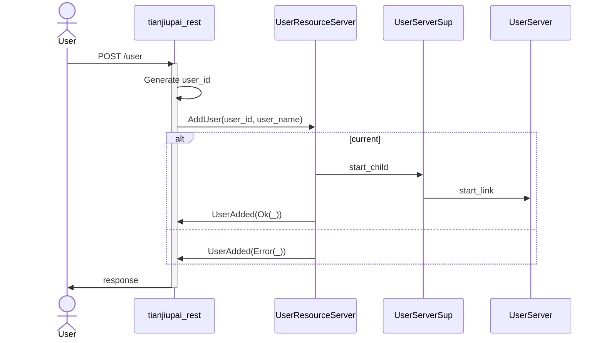
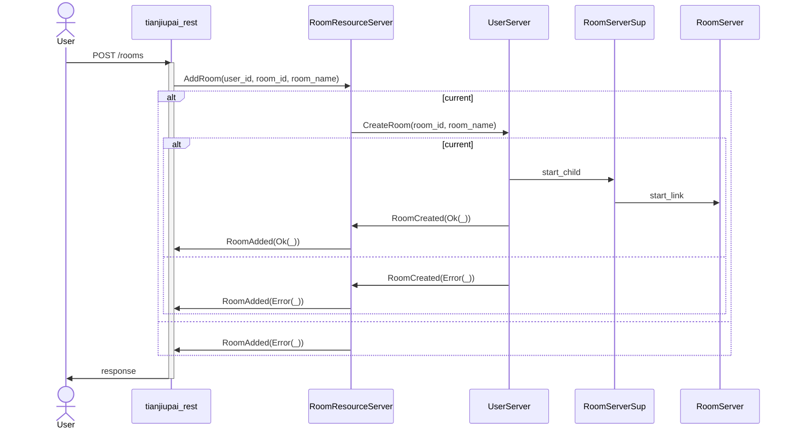

## 通信フローチャート

### ユーザ作成

### 部屋作成

## プロセス構成

* `UserServerSup` プロセス
  - 概要： `UserServer` プロセスたちを管理する．
  - 個数： 全体で1個
  - 存在期間： 恒に存在
  - 登録名： `Global({})`（Erlang： global, `{'Tianjiupai.UserServerSup', ok}`）
* `RoomServerSup` プロセス
  - 概要： `RoomServer` プロセスたちを管理する．
  - 個数： 全体で1個
  - 存在期間： 恒に存在
  - 登録名： `Global({})`（Erlang： global, `{'Tianjiupai.RoomServerSup', ok}`）
* `UserResourceServer`
  - 概要： ユーザ数を管理する．
  - 個数： 全体で1個
  - 存在期間： 恒に存在
  - 登録名： `Global({})`（Erlang： global, `{'Tianjiupai.UserResourceServer', ok}`）
  - モニタするプロセス：
    * 全ての存在する `UserServer` プロセス．
  - 受け取るメッセージ：
    * `tianjiupai_rest` プロセスから：
      - ユーザ作成依頼
    * `UserServer` プロセスから：
      - `DOWN`： ユーザが削除されたときに届く
* `RoomResourceServer`
  - 概要： 部屋数を管理する．
  - 個数： 全体で1個
  - 存在期間： 恒に存在
  - 登録名： `Global({})`（Erlang： global, `{'Tianjiupai.RoomResourceServer', ok}`）
  - モニタするプロセス：
    * 全ての存在する `RoomServer` プロセス．
  - 受け取るメッセージ：
    * `tianjiupai_rest` プロセスから：
      - 部屋作成依頼
    * `RoomServer` プロセスから：
      - `DOWN`： 部屋が消えたときに届く
* `UserServer`
  - 概要： 単一のユーザに関する状態を保持する．
  - 個数： ユーザごとに1つ
  - 存在期間： 対応するユーザが存在する間
    * 起動タイミング： 対応するユーザが作成されたとき，`UserResourceServer` によって起動される．
    * 終了タイミング： 対応するユーザが削除されたとき（対応するユーザから一定期間アクセスがなくタイムアウトしたときを含む）
  - 登録名： `Global(user_id)`（Erlang： global, `{'Tianjiupai.UserServer', UserId :: binary()}`）
  - モニタするプロセス：
    * 対応するユーザがいずれかの部屋に属しているとき，その部屋の `RoomServer` をモニタする．
      - `RoomServer` からの `DOWN` 受信時にやること： ユーザの所属の状態を変える．
  - 受け取るメッセージ：
    * `tianjiupai_rest` から：
      - ユーザ削除依頼
    * `RoomServer` から：
      - `DOWN`： 所属部屋の終了扱い
* `RoomServer`
  - 概要： 単一の部屋の状態（盤面など）を保持する．ゲームの進行上の根幹となるプロセス．
  - 個数： 部屋ごとに1つ
  - 存在期間： 対応する部屋が存在する間
    * 起動タイミング： 対応する部屋が作成されたとき，`RoomResourceServer` によって起動される．
    * 起動時にやること： 自身を `PlazaServer` にpublisherとして登録する
    * 終了タイミング： 対応する部屋が対局終了で消えたとき
    * 終了時にやること： なし
  - 登録名： `Global(room_id)`（Erlang： global, `{'Tianjiupai.RoomServer', RoomId :: binary()}`）
  - モニタするプロセス：
    * 在室ユーザの `UserServer`
      - `UserServer` からの `DOWN` 受信時にやること： そのユーザを退席扱いにする．
    * 在室ユーザが接続しているとき，その接続の `tianjiupai_websocket`
      - `tianjiupai_websocket` からの `DOWN` 受信時にやること： そのユーザを一時接続切れ扱いにする．
  - 受け取るメッセージ：
    * `RoomResourceServer` から：
      - 入室
    * `tianjiupai_rest` から：
      - 退室
      - 手番での牌の提示
    * `tianjiupai_websocket` から：
      - 接続通知
      - `DOWN`： 接続切れ
    * `UserServer` から：
      - `DOWN`： ユーザ削除時に送られてくる．退室と同じ扱いをする
  - 送るメッセージ：
    * `tianjiupai_websocket` へ：
      - 盤面更新通知
      - 終了時の `DOWN`（部屋終了通知）
    * `PlazaServer`
      - 在室メンバーや対戦中か否かなどの更新通知
      - 終了時の `DOWN`（部屋終了通知）
* `PlazaServer`
  - 概要： どんな部屋があるかを保持し，どの部屋にも属していないが接続してきているユーザに部屋の状況変化を通知する．Pub/Subのような機構．
  - 個数： 全体で1個
  - 存在期間： 恒に存在
  - モニタするプロセス：
    * 全 `RoomServer`
      - `RoomServer` からの `DOWN` 受信時にやること： 部屋一覧からその部屋を消す．
    * 所属部屋のないユーザの接続に対応する全 `tianjiupai_websocket`
      - `tianjiupai_websocket` からの `DOWN` 受信時にやること： 通知先一覧からそのプロセスを消す．
  - 受け取るメッセージ：
    * `RoomServer` から：
      - publisher登録
      - 部屋の状況変化通知
      - `DOWN`： publisher解除
    * `tianjiupai_websocket` から：
      - subscriber登録
      - subscriber解除
      - `DOWN`： subscriber解除と同じ扱い
  - 送るメッセージ：
    * subscriberの `tianjiupai_websocket` へ：
      - 部屋一覧の更新通知
* `tianjiupai_websocket`
  - 概要： 1ユーザのWebSocketでの1接続に対応するプロセス．
  - 個数： WebSocket接続を確立しているユーザの数だけ存在
  - 存在期間： WebSocketによる接続が確立している間
    * 起動タイミング： 対応するWebSocketの接続が開始したとき．`cowboy` によって起動される
    * 終了タイミング： 対応するWebSocketの接続が切れたとき，または切るべきとき．前者の場合は `cowboy` によって終了される．**一部VPN環境だと接続が切れないことがある？**
  - 登録名： global, `{tianjiupai_websocket, UserId :: binary()}`
  - 受け取るメッセージ
    * `RoomServer` から：
      - 対応するユーザが部屋に属しているとき，その部屋の状態の更新通知がくる．
    * `PlazaServer` から：
      - 対応するユーザが部屋に属していないとき，部屋一覧の更新通知がくる．
  - モニタするプロセス：
    * 対応するユーザの `UserServer`
      - `UserServer` からの `DOWN` 受信時にやること： WebSocket接続を能動的に切る．
    * 対応するユーザが部屋に属しているとき，その部屋の `RoomServer`
      - `RoomServer` からの `DOWN` 受信時にやること： 所属部屋が消えたことをクライアント側に通知する．
* `tianjiupai_rest`
  - 概要： 1 HTTPアクセスに対応するプロセス．
  - 個数： リクエストを受け取ったがまだレスポンスを返していないHTTPアクセスの数だけ存在
  - 存在期間： HTTPリクエストを受け取ってから返すまで
    * 起動タイミング： HTTPリクエストを受け取ったとき．`cowboy` によって起動される
    * 終了タイミング： 対応するHTTPレスポンスを返したとき．`cowboy` によって終了される
  - 登録名： なし
